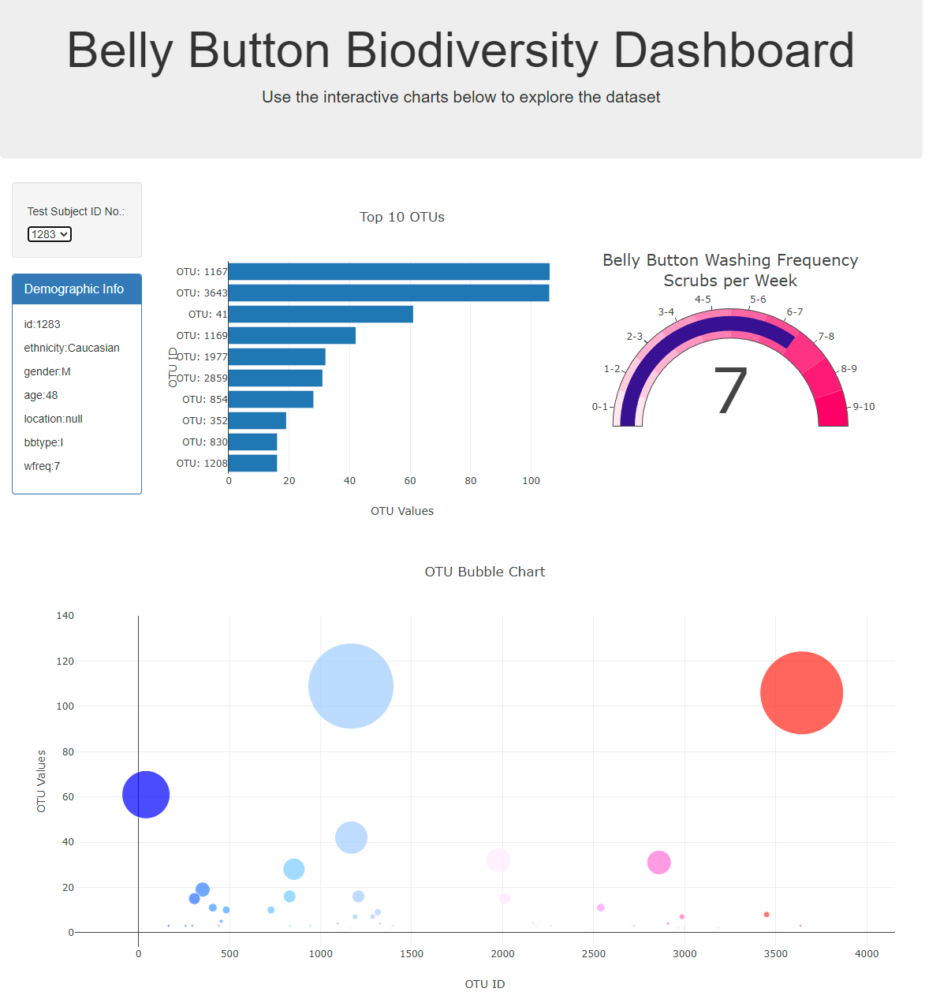
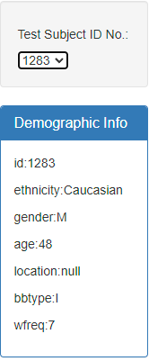
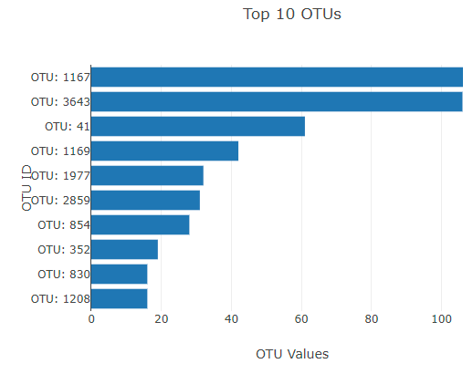
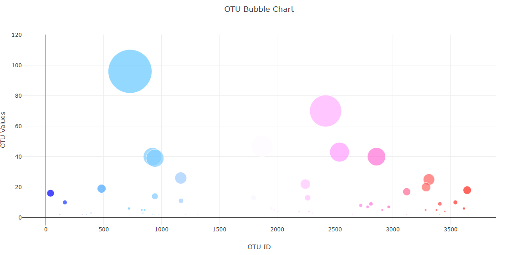
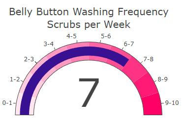

# NavelQuest Explorer: Unveiling Microbial Mysteries

## Background

This interactive dashboard explores the Belly Button Biodiversity dataset, which catalogs the microbes colonizing human navels. The dataset reveals prevalent microbial species (operational taxonomic units, OTUs) in human navels, shedding light on the diversity of microbes in this environment.

## Contents

- **samples.json**: Contains a copy of the data from [this URL](https://2u-data-curriculum-team.s3.amazonaws.com/dataviz-classroom/v1.1/14-Interactive-Web-Visualizations/02-Homework/samples.json).
- **index.html**: HTML structure for the app.
- **static/js/app.js**: JavaScript code processing samples.json and implementing the functional Dashboard.
- **images**: Folder with snapshots of the Dashboard.

## Dashboard Features

- **Dropdown**: Updates all charts and tables based on the selected test subject ID number.
- **Patient Demographics**: Horizontal bar graph displaying the top ten OTUs and their values.
- **Horizontal Bar**: Bubble graph representing the top ten OTUs found in patients' belly buttons, with larger circles indicating greater OTU values.
- **Bubble Graph**: Visualization providing a detailed view of the top ten OTUs.
- **Belly Button Wash Gauge**: Shows the frequency each patient was instructed to wash their belly buttons.

## Deployment

The app is deployed on GitHub Pages. Visit [Belly Button Challenge](https://shoggato.github.io/belly-button-challenge/) to explore the interactive dashboard.

## Final Findings

Observations suggest that a higher frequency of washings correlates with lower bacterial presence. However, surviving bacteria show higher frequency, possibly due to reduced competition for resources after eliminating most bacteria.

## Screenshots

